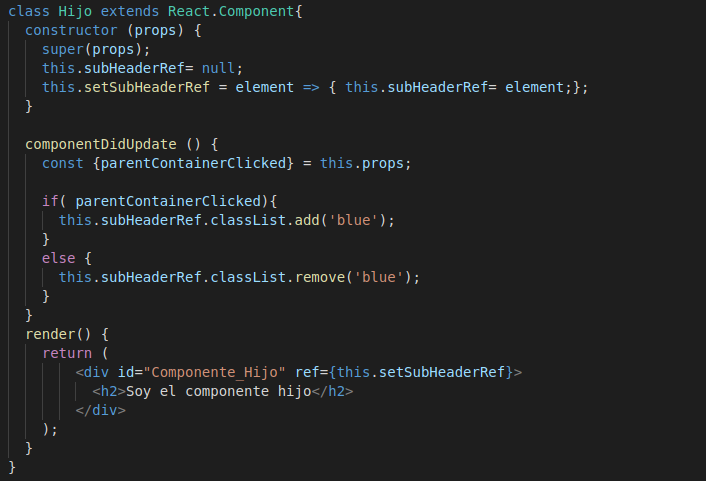

En este artículo nos centraremos en el uso de referencias en los componentes de React, lo cual otorga flexibilidad a la hora de manipular y manejar el DOM de nuestros componentes.

## Uso de las referencias

Según la [documentación oficial][enlace1] las referencias son una forma de acceder a los elementos del árbl DOM o elementos React creados en el método render, y se recomienda utilizarlas en los siguientes casos:

  - Controlar inputs o selección de texto.
  - Manejo de animaciones
  - Integraciones con bibliotecas de terceros que manipulen el DOM.

Existen dos maneras de declarar y trabajar con referencias. La primera es utilizando el método **React.createRef()** el cual se incorpora a partir de la versión 16.3 y la segunda es con las **callback refs**.

## Primer ejemplo con referencias

En el primer [ejemplo][enlace2] que vamos a desarrollar, crearemos una referencia al titulo del componente, para cambiar su color cuando pulsemos un botón:

Como podemos observar, creamos una referencia en el constructor llamada *title* mediante el método *createRef()*.
Después, en el método *render()* asignamos al elemento h1 la referencia creada en el constructor mediante el atributo *ref*. Mediante este método estamos enlazando el nodo del DOM a la referencia.

Ahora vamos a cambiar el color del título h1 cuando pulsemos el boton. Para ello invocamos a un método que realiza este proceso:

En dicho método accedemos a la referencia mediante su propiedad *current* la cual es la que representa el nodo del árbol DOM (**Nota:** No podemos hacer uso de la propiedad current en componentes de función, ya que estos no poseen instancias), y cambiamos su color:

## Referencias y componentes de funcion

Como hemos comentado anteriormente, no puedes usar el atributo ref en componentes de función debido a que no tienen instancias, por ello debemos convertirlo a un componente de clase.

Pero, podemos utilizar referencias dentro de componentes de función solamente si **hacen referencia a un elemento del DOM o de un componente de clase**. En el siguiente [ejemplo][enlace3], encontramos un componente de función *CustomTextInput*, el cual maneja una referencia, pero se refiere a un elemento *input*, gracias al cual podemos trabajar con la referencia:

## Referencias trabajando con un componente hijo

**Nota**: El código generado en este apartado lo puedes encontrar [aquí][enlace4].

A veces es necesario trabajar con referencias en componentes y sus derivados. Aquí plantearemos un ejemplo en el que hacemos click en un componente padre, y queremos que cambie tanto el color del padre como el color del hijo.

En primer lugar crearemos ambos componentes, los cuales tendrán una cabecera simple:

Para mantener el principio de encapsulación entre los componentes, es necesario que cada componente manipule su propio DOM, y que el componente padre no sepa cómo modificar el DOM de su hijo. Para ello pasaremos una propiedad al elemento hijo (*clicked*), mediante la cuál sabrá cuándo modificar su DOM, haciendo el código más simple y fácil de entender.

Una vez completamos ambos componentes, quedarían de la siguiente forma: 

Si has revisado el código, habrás visto el siguiente fragmento, tanto en el padre como en el hijo:
~~~
this.setSubHeaderRef = element => { this.subHeaderRef= element;};
~~~

Esto se conocen como **referencias mediante callback**, que proporcionan un control más detallado sobre las referencias. En vez de utilizar *createRef()*, pasamos una función, que recibe una instancia del componente React o el elemento DOM. El uso de ambos es correcto, pero *createRef()* se ha introducido en las últimas versiones de React, y por tanto el uso es más aconsejable.

&nbsp;
## Enlaces de interés

- <https://ed.team/blog/no-uses-getelementbyid-en-react-usa-las-referencias>
- <https://es.reactjs.org/docs/refs-and-the-dom.html>
- <https://medium.com/@normancolomagarca/manejando-referencias-sobre-diferentes-contextos-en-react-bc3ff674b568>

[enlace1]: https://es.reactjs.org/docs/refs-and-the-dom.html

[enlace2]: https://codepen.io/Javier_Herrero/pen/yLLraKO?editors=0010

[enlace3]: https://codepen.io/Javier_Herrero/pen/MWWRbQQ?editors=0010

[enlace4]: https://github.com/franberchez/Codigo_React