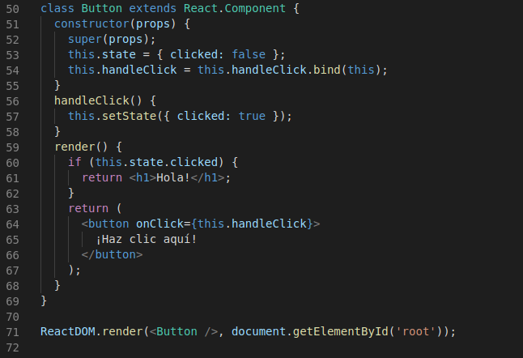
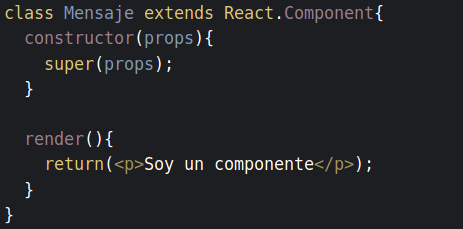

Como vimos anteriormente, React cuenta con dos tipos de componentes, los componentes funcionales y los componentes de clase. Pasemos a profundizar sobre estos últimos.

&nbsp;
## **Componentes de clase**

La principal diferencia entre los componentes de clase y los funcionales son los estados y los ciclos de vida, Pero primero, vamos a ver cómo trabajar con un componente de clase.

&nbsp;
### Ejemplo de componente de clase

Los componentes de clase tienen dos propiedades: **this.state** y **this.props**. La clase cuenta con una funcion *render()*, la cual se encarga de renderizar el componente en el navegador, y es llamada automáticamente cuando el componente se crea o cambia de estado. Para renderizar un componente de clase, lo invocamos como un componente funcional. En este [ejemplo][enlace] puedes comprobar el uso de *this.props* en un componente de clase.

&nbsp;
### **Estados**

Como hemos comentado, todo componente de clase tiene un estado. Es manejado por la variable state, y es actualizado mediante *setState()*, el cual fusiona los atributos del objeto actualizador con el estado del componente anterior. Por tanto, este estado está asociado al componente y se actualiza y manipula a medida que el usuario interactúa con la aplicación.

En el siguiente ejemplo puedes ver cómo se establece el estado de un componente que es un botón, y como se actualiza cuando es pulsado:

&nbsp;
Este ejemplo lo puedes probar [aquí][enlace2].

&nbsp;
### **Ciclos de vida**
Todos los componentes siguen unos ciclos de vida, que son funciones especiales que permiten ejecutar funciones y declarar lógica de manera más estructurada, lo cual nos proporciona mayor control sobre los componentes de la aplicación.

- **Constructor**: El estado se inicializa mediante el constructor.Este se ejecuta antes de que el componente sea montado en el DOM. Al método *constructor()* hay que pasarle *props* como parámetro, e invocar a super() para activar correctamente el componente.

- **componentWillMount()**: Este método es ejecutado justo antes de montar o renderizar el componente. Es adecuado, por ejemplo, para un cambio condicional en el estado.

- **render()**: Este método es el se utiliza para obtener los elementos finales a mostrar por el navegador. No debe modificar el *estado* ni realizar operaciones en el DOM.

- **componentDidMount**: Este método se ejecuta cuando el componente se ha montado en el DOM. Solamente se ejecuta una vez, y es idóneo para trabajar de manera asíncrona o llamadas a APIs.

- **componentWillReceiveProps**: Este método se ejecuta cuando el componente recibe nuevas props desde otro componente. Nos sirve para hacer validaciones en el cambio de las propiedades.

- **componentWillUpdate y shouldComponentUpdate**: Este método se ejecuta antes de realizar el *render()* en el componente, cuando se han recibido nuevos estados o *props*. Permite validar cambios en el estado o en las propiedades. El método *componentWillUpdate* se ejecuta cuando *shouldComponentUpdate* retorna verdadero, y realiza los últimos cambios antes de renderizar de nuevo el componente.

- **componentDidUpdate**: Este método se ejecuta justo después de que el componente haya sido actualizado y renderizado en el DOM.

- **componentWillUnmount**: Este método se ejecuta antes de que el componente sea destruido o eliminado del DOM. Se suele utilizar para dejar de escuchar eventos o cancelar peticiones pendientes.

&nbsp;
## Enlaces de interés

- <https://es.reactjs.org/docs/components-and-props.html>
- <https://codingpotions.com/react-componentes>
- <https://carlosazaustre.es/estructura-de-un-componente-en-react//>
- <https://medium.com/@simonhoyos/ciclos-de-vida-de-los-componentes-de-react-e1bf48a5ff73>

[enlace]: https://codepen.io/Javier_Herrero/pen/wvvrvrK?editors=0010
[enlace2]: https://codepen.io/Javier_Herrero/pen/YzzYKKw?editors=0010
