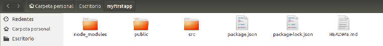
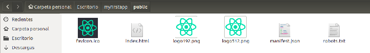
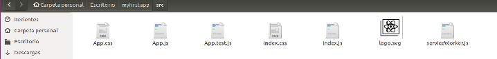

Una vez ejecutados los comandos del anterior [post][articulo], ya tenemos nuestro primer proyecto React creado. Ahora es necesario entender los directorios y archivos más importantes que se han generado. 

En primer lugar, al entrar en el directorio, encontramos lo siguiente:

&nbsp;

* **Directorio node_modules**: Aquí se guardan todas las dependencias del proyecto que son requeridas para el proyecto. Create-react-app ya nos habrá instalado unas cuantas por defecto.
* **Directorio public**: Esta es la raíz del proyecto y aquí estará el archivo principal: index.html y el *favicon* (icono que aparecerá en la pestaña del navegador cuando despleguemos la aplicación). Habrá una etiqueta dentro de index.html con un id “root” que nos indica dónde se va a introducir el componente principal (App.js) de nuestra aplicación.
* **Directorio src**: En esta carpeta, es donde están los componentes y sus estilos a parte de otros ficheros javascript que necesitemos. Por defecto, el componente principal de todo proyecto React JS se llama App.js. También habrá un index.js que se encarga de introducir el componente App en el de index.html que hemos mencionado en el punto anterior.
Encontramos también las hojas de estilo: App.css e index.css; una imagen (svg) del logo de React JS; un archivo para realizar tests sobre el componente App y un archivo javascript llamado registerServiceWorker.js. 
Este archivo introduce el concepto de **Progressive Web App (PWA)**. Las PWA son aplicaciones web rápidas y confiables, y funcionan en cualquier navegador. Además, permite trabajar sin conexión, ya que almacena los datos en memoria caché.
* Además, en este directorio encontramos el fichero **package.json**, el cual permite realizar una breve descripción del proyecto, estableciendo campos como el nombre, la versión, las dependencias de npm necesarias para trabajar (En este caso contiene react y react-dom), y contiene los comandos (start, build, test...) necesarios para trabajar con el servidor.

&nbsp;
Si accedemos al directorio **public**, encontramos el siguiente contenido, el cual hemos descrito anteriormente:

&nbsp;

&nbsp;
Por otra parte tenemos el directorio **src**, el cual hemos descrito anteriormente:

&nbsp;

[articulo]: ../introduccion/
[blog]: http://limni.net/blog/
