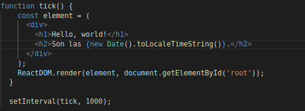
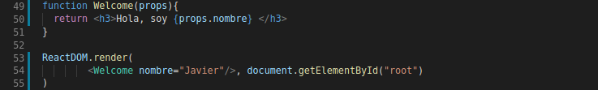
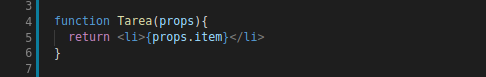
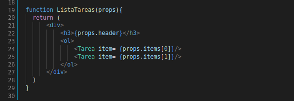
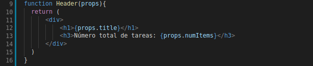
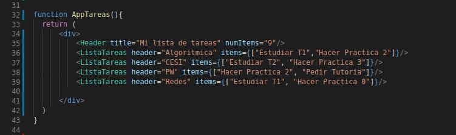
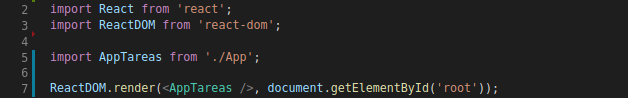

Tras conocer los conceptos básicos del [lenguaje JSX][articulo] y del directorio que hemos generado, pasaremos a profundizar sobre el concepto de **DOM** y la base de React JS, los **componentes**.

&nbsp;
## DOM

El DOM es la estructura de objetos que genera el navegador cuando se carga un documento y se puede alterar mediante Javascript para cambiar dinámicamente los contenidos y aspecto de la página.

En nuestra aplicación tomaremos un nodo raíz, y todo lo que esté dentro de él será manejado por React DOM, el cual lo renderiza mediante el método: `ReactDOM.render()`

La principal tarea de React DOM es comparar el elemento que le pasamos con el elemento anterior, y aplicar las actualizaciones necesarias en el DOM, es decir, actualiza el contenido del árbol cuando este cambia.

Para aclarar conceptos, vamos a realizar un ejemplo en el que crearemos un reloj:

&nbsp;

&nbsp;
En el ejemplo, el cual puedes probar [aquí][reloj_codigo], podemos observar el siguiente método:
* `setInterval(function,delay)`: El cual llama a *function* cada *delay* milisegundos.

Como hemos comentado, `ReactDOM.render()` solamente actualiza el elemento del DOM que cambia, en este caso es la hora.

&nbsp;
## ¿Qué es un componente?

Cualquier aplicación basada en React JS se contruye mediante componentes. Los componentes permiten separar la interfaz de usuario en piezas independientes, reutilizables y pensar en cada pieza de forma aislada. De forma coloquial, los componentes son como las funciones de JavaScript. Aceptan entradas arbitrarias (llamadas props) y devuelven a React elementos los cuales describen lo que debe aparecer en pantalla.

## Tipos de componentes

Existen dos tipos de componentes en React:
* Elementos funcionales o sin estado
* Elementos de clase o con estado

&nbsp;
### **Componentes funcionales**

Son aquellos componentes que generan elementos React, es decir, solo se encargan de mostrar o presentar datos, los cuales son aceptados mediante  argumentos, mediante un objeto *props*. Además, los componentes locales no guardan información y no necesitan datos locales, por tanto el componente no tendrá un ciclo de vida (Concepto que se explicará más adelante).

Las propiedades o **props** son parámetros que enviamos al componente durante su creación. Estos pueden ser datos para mostrar o información para inicializar el estado. Generalmente, los *props* son de solo lectura, por tanto, no se deben cambiar en el elemento propiamente dicho.

Para comprenderlo mejor, veamos un ejemplo:

&nbsp;

&nbsp;
Los argumentos son de un objeto *props*, el cual acepta parámetros, variables, arrays, condicionales, u otros elementos de React. Por ejemplo, aquí acepta el nombre, y lo muestra en pantalla
Puedes probar el ejemplo [aquí][props_ejemplo]

&nbsp;
### **Ejemplo de aplicacion**
Ahora pasemos a realizar un ejemplo, vamos a crear una simple lista de tareas por asignaturas. Primero comenzamos por crear un elemento que liste cada tarea:

&nbsp;

&nbsp;
Después crearemos un componente que liste las tareas por asignatura. Este elemento tendrá un título referido a la asignatura, y una serie de tareas, que será un array, en este caso con 2 elementos:

&nbsp;

&nbsp;
Acto seguido creamos el componente que creará el encabezado, y que mostrará el número total de tareas que tenemos:

&nbsp;

&nbsp;
Por último, creamos el componente principal, que será invocado desde el archivo *index.js*, y que invocará a los demás componentes. Este componente invoca en primer lugar a *Header* y *ListaTareas* que a su vez invocará al componente *Tarea*:

&nbsp;

&nbsp;
Por último desde el archivo *index.js* invocamos a 'AppTareas'. Previamente hemos de exportarla desde *App.js* mediante la expresión:

~~~
export default AppTareas;
~~~

&nbsp;

&nbsp;

&nbsp;
**El código de esta aplicación lo tienes [aqui][codigo]**

&nbsp;
## Enlaces de interés

- <https://es.reactjs.org/docs/components-and-props.html>
- <https://codingpotions.com/react-componentes>
- <https://www.oscarblancarteblog.com/2018/09/26/componentes-con-estado-y-sin-estado/>

[articulo]: ../jsx

[codigo]: https://github.com/franberchez/Codigo_React

[props_ejemplo]: https://codepen.io/Javier_Herrero/pen/qBBjWYK?editors=0010

[reloj_codigo]: https://codepen.io/Javier_Herrero/pen/RwwVVMm